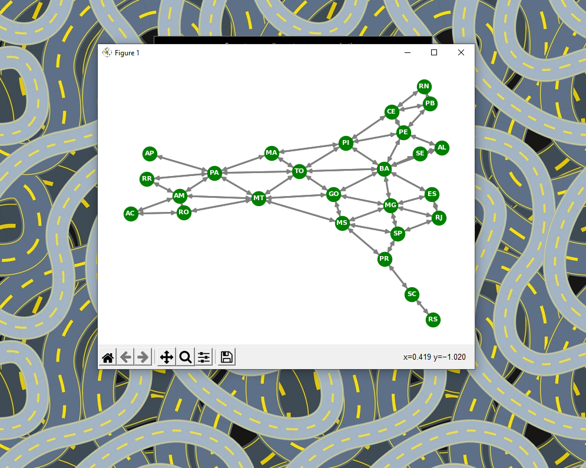
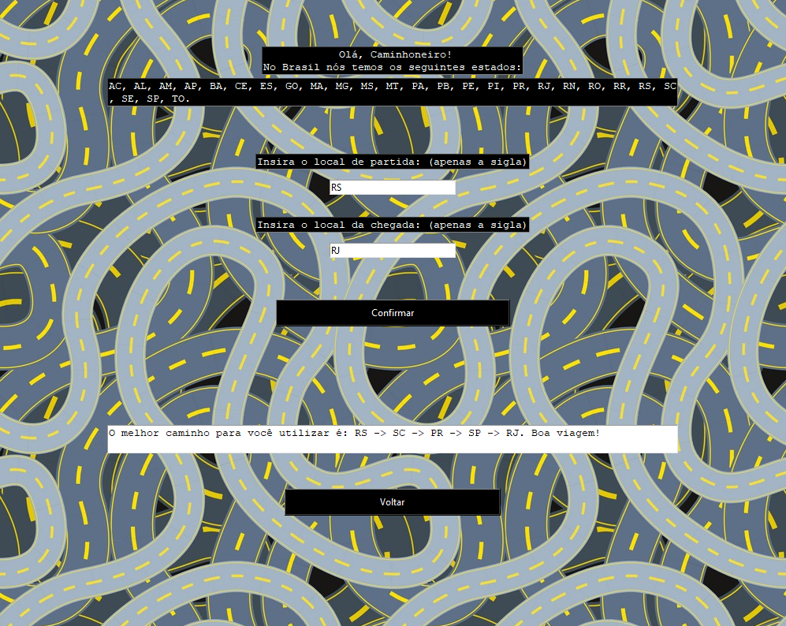
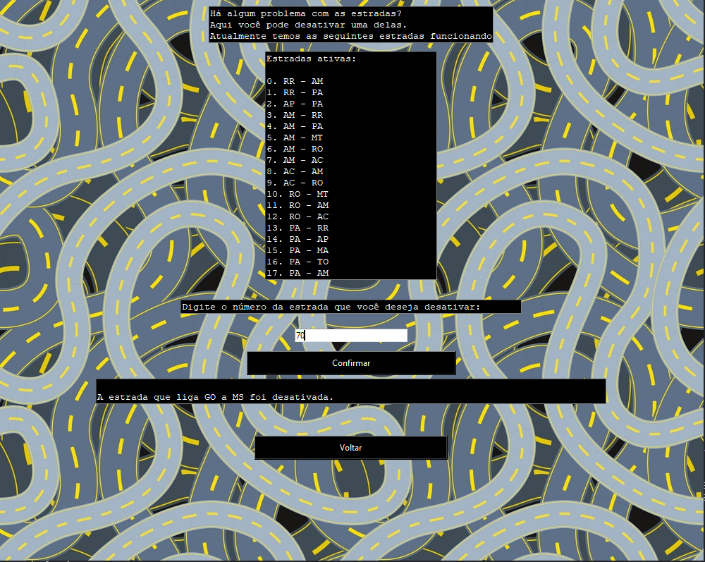

# Siga Bem Caminhoneiro

**Número da Lista**: 1<br>
**Conteúdo da Disciplina**: Grafos 1<br>

## Alunos
|Matrícula | Aluno |
| -- | -- |
| 18/0101617  |  Guilherme de Morais Richter |
| 18/0102613  |  Ítalo Fernandes Sales de Serra |

## Apresentação
Clique no link para assistir à apresentação: https://youtu.be/LRhwsSJiGTc

## Sobre 
A ideia por trás deste projeto é auxiliar caminhoneiros a terem conhecimento sobre qual é o melhor caminhos entre os estados do Brasil por meio das estradas interestaduais. O programa possui dois perfis:
- <b>Caminhoneiro</b>: Perfil em que o caminhoneiro pode solicitar a melhor rota que deseja, ver quais estradas estão em funcionamento ou não e ver um mapa das estradas em funcionamento.
- <b>Fiscal do DER</b>: Perfil em que um fiscal do DER pode entrar no aplicativo para gerenciar as estradas. Suponha que haja um acidente ou desmoronamento de uma estrada. O fiscal pode entrar no programa e desativar essa estrada, o que faz com que os caminhoneiros que procurem uma rota sejam automaticamente desviados da estrada sinalizada pelo fiscal do DER. Além disso, o fiscal do DER pode ver quais estradas estão em funcionamento ou não e ver um mapa das estradas em funcionamento.

## Screenshots

<b>Screenshot do menu inicial.</b>


<b>Screenshot do menu do caminhoneiro.</b>


<b>Screenshot da opção de ver mapa.</b>


<b>Screenshot da opção de solicitar uma rota.</b>


<b>Screenshot do menu do fiscal do DER.</b>


<b>Screenshot da opção de inativar uma estrada.</b>



## Instalação 
**Linguagem**: Python<br>
**Framework**: Tkinter (biblioteca), NetworkX (biblioteca)<br>


Para criar um ambiente em que seja possível rodar o programa, é necessário:

- Instalar a versão <b>3.9.5</b> do Python.

- Instalar via terminal as seguintes bibliotecas

```python
pip install tk
```
```python
pip install networkx
```
```python
pip install matplotlib
```

- Clonar o nosso repositório do GitHub para a sua máquina, digitando no terminal (necessário ter o Git instalado):

```python
git clone https://github.com/projeto-de-algoritmos/Grafos1_SigaBemCaminhoneiro.git
```

## Uso 

Para utilizar o nosso programa, é necessário que navegue no terminal até o diretório em que está clonado o nosso repositório, no caso, <b>Grafos1_SigaBemCaminhoneiro</b>.

Com o repositório aberto, rodar o seguinte comando:

```python
python interface.py
```

## Outros 

Uma observação é quanto ao mapa gerado. Por estarmos utilizando a função de plotagem do matplotlib, e de desenho de grafo do NetworkX, é uma impossibilidade dessa tecnologia manter 100% das vezes o grafo visualmente organizado. Então, se ao clicar no botão <b>Ver um mapa com estradas atuais</b> for gerado um grafo um pouco confuso, basta fechá-lo e gerar um novo mapa novamente, que o mesmo estará organizado de outra forma - mas sem perder suas propriedades físicas fundamentais, como os nós e suas arestas.
